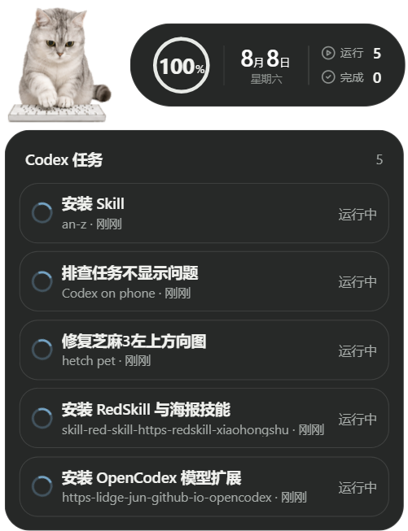
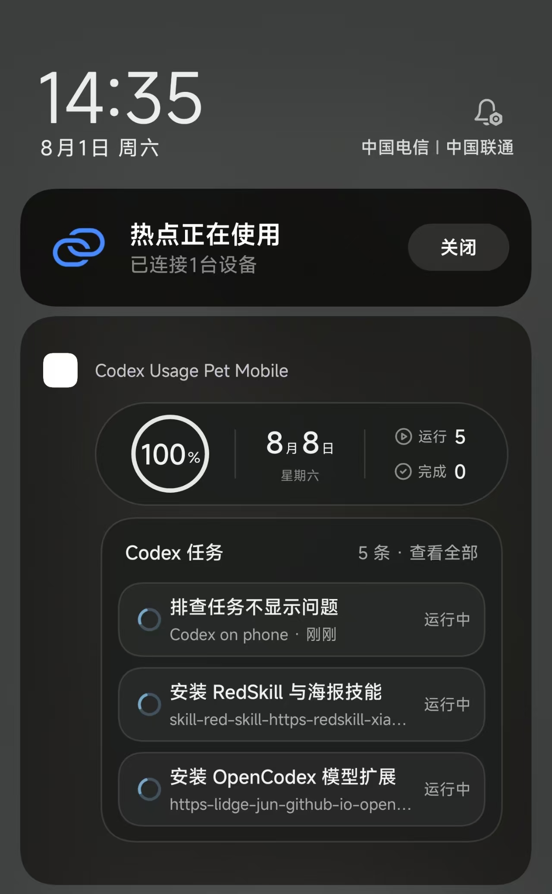
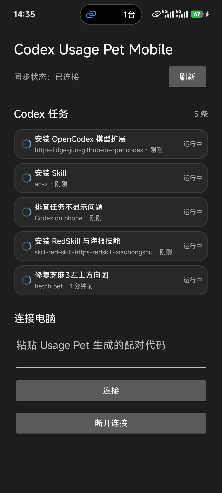

# Codex Usage Pet

<p align="center">
  <strong>A desktop Codex companion that lets your phone tell you when attention is useful.</strong>
</p>

<p align="center">
  <a href="README.md"><strong>English</strong></a>
  &nbsp;|&nbsp;
  <a href="README.zh-CN.md">简体中文</a>
</p>

Codex Usage Pet is one product with three independently built parts:

- a Windows desktop pet that reads local Codex state in read-only mode;
- a ciphertext-only Cloudflare relay;
- a native Android companion that renders usage and task state in the system
  notification shade.

The computer is the only Codex reader. It selects the minimum display fields,
encrypts them before they leave the machine, and publishes ciphertext. The
relay cannot decrypt it. The paired phone decrypts locally and updates its
notification.

## Current status

| Area | Status |
| --- | --- |
| Windows desktop pet | Implemented and locally verified |
| Cloudflare encrypted relay | Implemented; deployment is account-specific |
| Android companion | Implemented and locally tested; Xiaomi physical-device gates remain |
| macOS publisher | Porting blueprint only |
| iPhone companion | Porting blueprint only; requires a native iOS/APNs design |
| Public release | Published as a sanitized MIT snapshot; example assets have separate terms |

Windows + Android is the reference implementation. “Blueprint” means the
repository explains how to port it; it does not mean macOS or iPhone support is
finished.

## Why this exists

Remote-control software is useful when front-end work still needs the real
computer: browser previews, terminals, local tools, and visual checks. But once
a Codex task is sent, keeping the remote session open—or reopening it every few
minutes—turns waiting into another job.

This project makes waiting passive. Start the work on the computer, let the
desktop pet show the real local state, and use the phone notification to know
when the task is running, waiting, complete, or failed. The same glance also
shows remaining usage, the reset date, and the tasks that still need attention.

There is a second, practical advantage: the desktop companion reads Codex
Desktop's local state directly, in read-only mode, and looks in the existing
Codex pet directory (`~/.codex/pets`) for standard Hatch Pet packages. Your
familiar desktop pet can come with you instead of being recreated in a second
app. A valid user-installed package takes precedence over the bundled fallback,
so the first run is closer to launch-and-go: no manual export, asset conversion,
or copy-and-paste bridge.

This also started from a distinction between remote control and status
monitoring. Official Codex Remote is useful for sending work, but network
round trips can make the experience feel slow, and it is not a window into the
computer's local frontend previews, IDEs, terminals, or other desktop context.
For hands-on work, a remote desktop tool can control the actual computer more
directly, clearly, and quickly. Usage Pet complements that setup: it does not
replace remote control or stream the desktop to the phone; it reads local
Codex state and pushes timely task progress. The remote desktop handles
“control the computer,” while Usage Pet handles “tell me what the task is
doing,” without making Codex Remote the monitoring channel.

Read the full story in [Why Codex Usage Pet exists](docs/development-story.md).

## What you get

### On the computer

- Hatch Pet animation for `idle`, `running`, `waiting`, `review`, and `failed`.
- Remaining weekly usage and reset date, with an honest unavailable state.
- Running, waiting, failed, and unread-review tasks.
- Direct thread opening where the installed Codex version supports it.
- Dragging, unified scaling, light/dark themes, and a tray lifecycle.
- Read-only Codex access: no patching or injection into the official client.

### On Android

- A persistent, silently updating status notification.
- The same usage capsule and task hierarchy as the desktop.
- Three complete notification rows plus a `View all` path into the App's
  scrollable complete synchronized task list.
- One short alert for a new attention-worthy transition; normal refresh and
  heartbeat remain silent.
- Protected pairing, authenticated decryption, replay rejection, reconnect,
  last-good state, and stale-state reporting.

Task bodies, response bodies, tool data, Codex credentials, cookies, raw
rollouts, and local paths are not part of the phone snapshot.

## Reference surfaces

<p align="center">
  
</p>

<p align="center">
  
  
</p>

These public images are project-owner-provided runtime captures. They document
the desktop surface, notification delivery, and Android task list at one point
in time; they do not replace Xiaomi physical-device acceptance. Review and
redact local task or device details before publishing a different capture.

## Architecture

```text
Local Codex state
      |
      v
Windows Usage Pet
read-only interpretation -> approved projection -> AES-256-GCM
      |
      v
Cloudflare Worker + Durable Object
authentication -> latest ciphertext -> WebSocket broadcast
      |
      v
Android companion
protected pairing -> decrypt/validate/replay guard -> system notification
```

These are not one executable. They live in one repository so protocol, privacy,
task meaning, and end-to-end acceptance change together.

See [System architecture](docs/system-architecture.md) and the
[phone protocol](phone/docs/protocol.md).

## Get started

### If your devices are Windows + Android

This is the implemented route.

1. Install and sign in to Codex on the Windows computer.
2. Build and verify the desktop app:

   ```powershell
   git clone https://github.com/Adieuuuuuu/codex-usage-pet-public.git
   cd codex-usage-pet-public
   npm.cmd ci
   npm.cmd run check
   npm.cmd run start
   ```

3. Confirm the desktop pet shows a real Codex task and correct usage—or an
   honest unavailable state—before enabling phone sync.
4. Verify the relay locally under `phone/cloudflare`, then explicitly authorize
   a Cloudflare deployment or choose a compatible self-hosted relay.
5. Build the Android client under `phone/`, install the APK only with the
   device owner's approval, and grant notifications.
6. Pair from the desktop. On Xiaomi/HyperOS, enable autostart and unrestricted
   battery use if you accept the background/battery tradeoff.
7. Run the real-device gate in
   [`phone/docs/xiaomi-gate.md`](phone/docs/xiaomi-gate.md).

Detailed, Agent-oriented steps are in the
[Agent replication guide](docs/agent-replication-guide.md).

### If your devices are different

Give this repository link to your implementation Agent and ask it to start with
the Agent guide. It must first ask for:

- computer OS/version/architecture;
- phone OS/version/model;
- Codex installation and one harmless real-state test;
- Cloudflare versus self-hosted relay;
- signing, deployment, sideloading, and device-permission choices;
- direct network, proxy, or VPN constraints;
- available and redistributable pet assets.

Then it should select the matching route from the
[Windows/macOS × Android/iPhone matrix](docs/platform-porting-guide.md).

Do not treat an iPhone as “Android with different UI.” iOS remote notifications
use APNs, and background updates are not guaranteed. Do not treat macOS as
“Windows with different paths.” Discover and test the installed Codex layout,
Keychain, startup, packaging, and deep-link behavior.

## How to use it

1. Start Codex and Usage Pet on the computer.
2. Check that the desktop capsule and task list are current.
3. Keep the desktop publisher running and online.
4. Pair the phone once through the protected, short-lived pairing flow.
5. Leave the ongoing status notification enabled.
6. Return to the remote-control session only when the phone says attention is
   useful.

If the desktop publisher stops, the phone may keep the last verified snapshot,
but it cannot receive fresh state. The app must show that state as stale rather
than pretending it is live.

## Documentation

### Start here

- [Agent replication guide](docs/agent-replication-guide.md) — the handoff
  document to give another Codex/Agent.
- [Platform porting guide](docs/platform-porting-guide.md) — Windows/macOS ×
  Android/iPhone matrix and migration steps.
- [Development story](docs/development-story.md) — problem, decisions, work,
  results, and lessons.

### Build and operate
- [Asset licenses](ASSET-LICENSES.md)
- [Security policy](SECURITY.md)

- [Public Agent rules template](docs/public-AGENTS.md)
- [Permissions, network, and deployment](docs/permissions-network-and-deployment.md)
- [Visual references and pet assets](docs/visual-reference-guide.md)
- [System architecture](docs/system-architecture.md)
- [Phone protocol](phone/docs/protocol.md)
- [Android and relay guide](phone/README.md)
- [Xiaomi physical-device gate](phone/docs/xiaomi-gate.md)

This public snapshot keeps the portable rules at root `AGENTS.md` and retains
`docs/public-AGENTS.md` as the source template. An implementation Agent should
read the root rules first. The owner's internal rules, raw verification log,
deployment history, and private device evidence are intentionally absent.

## Pet assets and visual references

Usage Pet renders standard Hatch Pet packages (`pet.json` plus
`spritesheet.webp`). This public snapshot includes the licensed `zhima-3`
v2 package as a working default, so a user without a custom pet can clone,
build, and start the desktop app. A valid user-installed package under the
user's Codex pet directory takes precedence when it uses the same ID.

A custom pet remains optional. Validate its manifest, atlas dimensions, and
license before packaging or redistribution. The three public runtime images
under `docs/images/` document the desktop surface, notification delivery, and
Android task list. See the [visual reference guide](docs/visual-reference-guide.md)
and [asset licenses](ASSET-LICENSES.md).

## Privacy and honest boundaries

- Codex data access is local and read-only.
- Encryption happens on the desktop; the relay does not receive the content
  key.
- Pairing material is protected with OS credential storage on both endpoints.
- No secret, deployed endpoint, room ID, device token, or account identifier
  belongs in source, docs, logs, issues, or screenshots.
- Local tests do not replace Cloudflare read-back, installation, or
  physical-device evidence.
- Android SystemUI/HyperOS owns the outer notification chrome and expansion
  behavior.

The source code and documentation are licensed under the [MIT License](LICENSE).
The example pet, derived icon, screenshots, synthesized notification sound, and
Gradle wrapper have the separate provenance and terms recorded in
[ASSET-LICENSES.md](ASSET-LICENSES.md). Future assets must be cleared before
publication; repository visibility is never enough by itself.

## Feedback

When reporting a problem, include the OS/device version, app version,
reproduction steps, and redacted logs. Never upload prompts, responses,
credentials, pairing bundles, tokens, cookies, complete Codex databases, or
private task screenshots.
