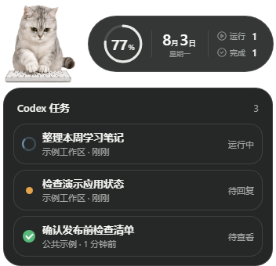
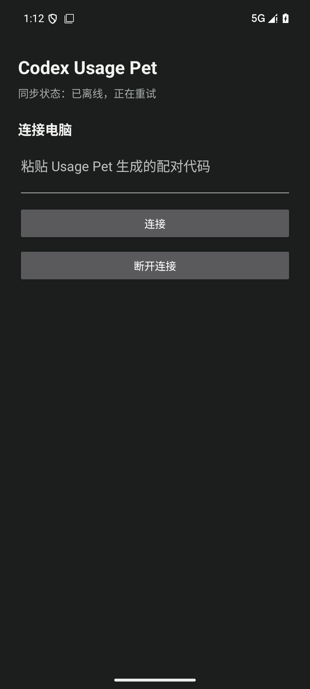

# Codex Usage Pet

<p align="center">
  <strong>让电脑上的 Codex 状态变成桌宠，也让手机在真正需要你时提醒你。</strong>
</p>

<p align="center">
  <a href="README.md">English</a>
  &nbsp;|&nbsp;
  <a href="README.zh-CN.md"><strong>简体中文</strong></a>
</p>

Codex Usage Pet 是一个产品，包含三个可以独立构建的部分：

- Windows 桌面宠物：只读本机 Codex 状态；
- Cloudflare 密文中继；
- 原生 Android 手机端：在系统通知栏显示用量和任务状态。

电脑端是唯一的 Codex 数据读取者。它只挑选手机界面需要的字段，在离开
电脑前完成加密；中继无法解密；配对后的手机在本地解密并更新系统通知。

## 当前完成度

| 范围 | 当前状态 |
| --- | --- |
| Windows 桌面宠物 | 已实现并完成本地验证 |
| Cloudflare 加密中继 | 已实现；部署仍取决于每位用户自己的账号 |
| Android 手机端 | 已实现并通过本地测试；小米真机门禁仍需完成 |
| macOS 电脑端 | 只有经过约束分析的移植蓝图，尚未实现 |
| iPhone 手机端 | 只有原生 iOS/APNs 移植蓝图，尚未实现 |
| 公开发布 | 已准备公开发布为脱敏 MIT 快照；示例素材使用独立许可 |

目前真正存在的参考组合是 **Windows + Android**。文档里写“移植蓝图”，
代表 Agent 知道应该怎样开发，不代表 macOS 或 iPhone 已经可以直接用。

## 为什么要做它

做前端项目时，浏览器预览、终端、本地工具和视觉验收仍然发生在电脑上。
远控可以让人离开电脑继续操作，但发出一个 Codex 任务以后，如果必须一直
挂着远控，或者每隔几分钟重新打开查看，等待本身就变成了另一项工作。

这个项目想解决的是这段“等待焦虑”：在电脑上启动任务，桌宠反映真实本地
状态；当任务仍在运行、等待输入、完成或失败时，手机用一个及时的通知告诉
你什么时候值得回来。顺便还能看到剩余用量、Reset 日期和需要关注的任务。

完整背景和开发过程见
[《为什么会有 Codex Usage Pet》](docs/development-story.md)。

## 你会得到什么

### 电脑端

- 用 `idle`、`running`、`waiting`、`review`、`failed` 驱动 Hatch Pet 动画；
- 查看周用量剩余比例和 Reset 日期，读不到时诚实显示不可用；
- 查看运行中、等待输入、失败和未读待查看任务；
- 在当前 Codex 版本支持时跳转对应会话；
- 拖动、整体缩放、浅色/深色和托盘常驻；
- 只读 Codex 数据，不修改、替换或注入官方客户端。

### Android 手机端

- 一个持续存在、普通刷新保持静默的状态通知；
- 与电脑端一致的用量胶囊和任务信息层级；
- 新的需要关注状态最多提醒一次，心跳和普通刷新不打扰；
- 受保护的配对、认证解密、防重放、自动重连、最后可信状态和过期提示。

手机快照不包含提示词正文、回复正文、工具输入输出、Codex 凭据、cookie、
原始 rollout 或本机路径。

## 公开版参考界面





这两张图只作为已经清理来源和隐私的实现参考，不包含 endpoint、配对秘密、
真实任务标题、提示词或回复正文，也不能替代小米真机验收。

## 架构

```text
本机 Codex 状态
      |
      v
Windows Usage Pet
只读解释 -> 最小字段投影 -> AES-256-GCM 加密
      |
      v
Cloudflare Worker + Durable Object
房间认证 -> 保存最新密文 -> WebSocket 广播
      |
      v
Android 手机端
受保护配对 -> 解密/校验/防重放 -> 系统通知
```

它们不是一个可执行程序。之所以放在一个仓库，是为了让协议、隐私边界、
任务语义和端到端验收一起变化。

深入阅读：[系统架构](docs/system-architecture.md)、
[手机同步协议](phone/docs/protocol.md)。

## 怎么上手

### 你的设备是 Windows + Android

这是当前已经实现的路线。

1. 在 Windows 电脑安装并登录 Codex。
2. 构建并验证电脑端：

   ```powershell
   git clone https://github.com/Adieuuuuuu/codex-usage-pet-public.git
   cd codex-usage-pet-public
   npm.cmd ci
   npm.cmd run check
   npm.cmd run start
   ```

3. 先启动一个真实 Codex 任务，确认桌宠、任务和用量正确；读不到用量时必须
   显示不可用，不能拿旧数字冒充实时数据。
4. 在 `phone/cloudflare` 完成本地测试和部署 dry run，再由用户明确授权
   Cloudflare 部署；也可以选择满足同一协议的自建 HTTPS/WSS 服务。
5. 在 `phone/` 构建 Android 客户端；只有得到设备所有者同意后才安装 APK
   并授权通知。
6. 从电脑端发起短时配对。小米/HyperOS 用户如果接受后台运行和耗电权衡，
   再打开自启动与“不限制”电量策略。
7. 用 [`phone/docs/xiaomi-gate.md`](phone/docs/xiaomi-gate.md)
   完成真机验收。

详细操作见 [Agent 复刻指南](docs/agent-replication-guide.md)。

### 你的设备不是这个组合

把仓库链接交给你的 Agent，让它先读 Agent 复刻指南。真正动手前，它必须先
问清：

- 电脑系统、版本和 CPU 架构；
- 手机系统、版本和设备型号；
- Codex 是否已经安装，并能否运行一个无害的真实状态测试；
- 使用 Cloudflare 还是自建中继；
- 签名、部署、侧载和设备权限的选择；
- 直连、代理或 VPN 的网络约束；
- 现有桌宠素材及其是否允许分发。

然后从
[Windows/macOS × Android/iPhone 平台矩阵](docs/platform-porting-guide.md)
选择对应路线。

不能把 iPhone 当成“换了 UI 的 Android”：iOS 远程通知依赖 APNs，后台
更新也不保证持续到达。也不能把 macOS 当成“路径不同的 Windows”：必须
重新发现和验证当前 Codex 的本地结构、Keychain、启动方式、打包签名和
deep link。

## 平时怎么用

1. 在电脑上打开 Codex 和 Usage Pet。
2. 先确认桌面胶囊和任务列表是当前真实状态。
3. 保持电脑端发布程序在线运行。
4. 通过受保护、短时有效的流程完成一次手机配对。
5. 保留持续状态通知。
6. 手机提示真正需要关注时，再回到远控处理。

电脑端停止运行以后，手机可以保留最后一次已验证快照，但不会得到新状态。
此时必须标记为过期，不能继续假装在线。

## 文档索引

### 建议先读

- [Agent 复刻指南](docs/agent-replication-guide.md)：把仓库交给其他
  Codex/Agent 时使用的主入口；
- [跨平台移植指南](docs/platform-porting-guide.md)：Windows/macOS ×
  Android/iPhone 的判断和步骤；
- [开发历程](docs/development-story.md)：背景、决策、行动、结果与经验。

### 构建与运行
- [素材许可说明](ASSET-LICENSES.md)
- [Security policy](SECURITY.md)

- [公开仓库 Agent 规则模板](docs/public-AGENTS.md)
- [权限、网络与部署](docs/permissions-network-and-deployment.md)
- [参考图与桌宠素材](docs/visual-reference-guide.md)
- [系统架构](docs/system-architecture.md)
- [手机同步协议](phone/docs/protocol.md)
- [Android 与中继说明](phone/README.md)
- [小米真机门禁](phone/docs/xiaomi-gate.md)

本公开快照已把便携规则放在根目录 `AGENTS.md`，同时保留
`docs/public-AGENTS.md` 作为模板源。实现 Agent 应先读根规则。项目所有者的
内部规则、原始验证日志、部署历史和私人设备证据没有进入公开仓库。

## 桌宠素材与参考图

Usage Pet 读取标准 Hatch Pet 包：`pet.json` 加 `spritesheet.webp`。
公开快照已经附带获得公开授权的 `zhima-3` v2 包作为可运行默认宠物，
因此用户即使没有做过自定义桌宠，也能克隆、构建并启动电脑端。同一 ID 的
有效用户安装包会按现有优先级覆盖内置包。

自定义桌宠仍然是可选项。打包或再次分发前要验证 manifest、图集尺寸和许可。
`docs/images/` 中两张公开图记录了桌面信息层级与 Android 0.3.0 正式界面。
详细边界见[参考图与桌宠素材说明](docs/visual-reference-guide.md)和
[素材许可说明](ASSET-LICENSES.md)。

## 隐私与真实边界

- Codex 数据只在本机只读访问；
- 数据离开电脑前已经加密，中继没有内容密钥；
- 电脑和手机分别使用系统凭据保护能力保存配对信息；
- 密钥、生产 endpoint、room ID、device token、账号标识不能进入源码、
  文档、日志、Issue 或截图；
- 本地测试不能代替真实部署回读、安装结果和物理设备证据；
- 通知外框、展开方式和部分间距由 Android SystemUI/HyperOS 控制。

源码和文档使用 [MIT License](LICENSE)。示例桌宠、衍生图标、公开截图、
全新合成提示音以及 Gradle Wrapper 的来源与独立条款记录在
[ASSET-LICENSES.md](ASSET-LICENSES.md)。以后新增素材仍必须先清理权利；
“仓库公开可见”本身永远不能代替素材授权。

## 反馈问题

反馈时请提供系统/设备版本、应用版本、复现步骤和脱敏日志。不要上传提示词、
回复正文、凭据、配对信息、token、cookie、完整 Codex 数据库或含私人任务
的截图。
